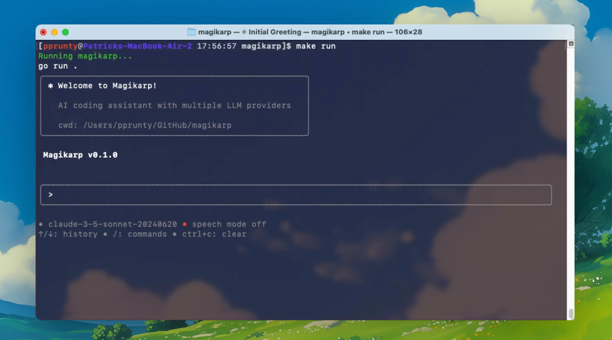

# magikarp

An open-source coding assistant CLI tool built with Go. Magikarp provides an interactive terminal interface for AI-powered coding assistance with support for multiple LLM providers (Claude, GPT, Gemini, Mistral).

This project's journey will be document over on Subtack as part of my [Build Your Own Claude Code](https://furrycircuits.io) series. Stay tuned!




## Prerequisites

Before installing Magikarp, ensure you have the following installed:

- **Go 1.24.2 or later** - [Download Go](https://golang.org/dl/)
- **Git** - [Install Git](https://git-scm.com/downloads)
- **Make** (optional, but recommended) - Usually pre-installed on macOS/Linux, [install on Windows](https://gnuwin32.sourceforge.net/packages/make.htm)

## Quickstart

### Local Development Setup

1. **Clone the repository:**
   ```bash
   git clone https://github.com/pprunty/magikarp.git
   cd magikarp
   ```

2. **Install dependencies and build:**
   ```bash
   make install
   ```

3. **Run Magikarp:**
   ```bash
   make run
   ```

### Alternative Commands

- **Build only:** `make build` (creates `bin/magikarp`)
- **Clean build artifacts:** `make clean`
- **Format code:** `make fmt`
- **View all commands:** `make help`

### Configuration

Set up your API keys by creating a `.env` file:

1. **Copy the template:**
   ```bash
   cp .env.example .env
   ```

2. **Edit `.env` with your API keys:**
   ```bash
   # Anthropic API Key (for Claude models)
   ANTHROPIC_API_KEY=your_anthropic_api_key_here

   # OpenAI API Key (for GPT models)  
   OPENAI_API_KEY=your_openai_api_key_here

   # Google Gemini API Key (for Gemini models)
   GEMINI_API_KEY=your_gemini_api_key_here

   # Mistral AI API Key 
   MISTRAL_API_KEY=your_mistral_api_key_here
   ```

Alternatively, you can set up your API keys as environment variables:

```bash
export ANTHROPIC_API_KEY="your-anthropic-key"
export OPENAI_API_KEY="your-openai-key"
export GEMINI_API_KEY="your-gemini-key"
export MISTRAL_API_KEY="your-mistral-key"
```

**Where to get your API keys**

- **Anthropic (Claude):** <https://console.anthropic.com/account/keys>
- **OpenAI (GPT):** <https://platform.openai.com/account/api-keys>
- **Google Gemini (AI Studio):** <https://makersuite.google.com/app/apikey> (create an API key in Google AI Studio)
- **Mistral AI:** <https://console.mistral.ai/api-keys>
- **Alibaba:** <https://www.alibabacloud.com/help/en/model-studio/first-api-call-to-qwen>

## Feature Checklist

- [x] Basic UI terminal
- [ ] LLM Provider SDK with sbtract interface for Gemini, GPT, Claude, also include claude-code SDK
- [ ] Optimized tools (i.e `find_file`) with toolboxing (i.e `filesystem/` -> `read_file`, `write_file`, `update_file` etc.)
- [ ] Release first version for `brew`, `yum`, `go install`, etc. using `GoReleaser`
- [ ] Speech-to-text mode
- [ ] /init command for creating `AGENT.md` (hopefully LLM providers can agree on universal convention sometime soon...)
- [ ] Automatic model selection based on user prompt (i.e auto choose best model for the task)
- [ ] MCP integration
- [ ] Default built-in `magikarp` agent which on user prompt writes back to core codebase to do things like create new slash commands, new tools, etc.
- [ ] Show file difference on update
    - [ ] Prompt user to accept/reject updates
- [ ] Parallel processing for independent tasks
    - [ ] master/slave toggle for spinning up multiple agents to complete long tasks
- [ ] Plan mode with optimized model selection, i.e setup could use o3 for planning, gemini for scrutinizing, claude for coding up the plan
- [ ] Ability to write back to system prompt with hot reload, something like [Karpathy mentions here](https://x.com/karpathy/status/1921368644069765486)
- [ ] Run magikarp as shorcut on terminal, i.e `mgk --prompt push all changes to git`

## Contributing

If you have any ideas on what else you'd like to see in this project, don't hesitate to let me know on [X](https://x.com/pprunty_), or by creating an issue on [GitHub](https://github.com/pprunty/magikarp/issues).

## License

Licensed under the [MIT license](./LICENSE).

Copyright (c) 2025 Patrick Prunty