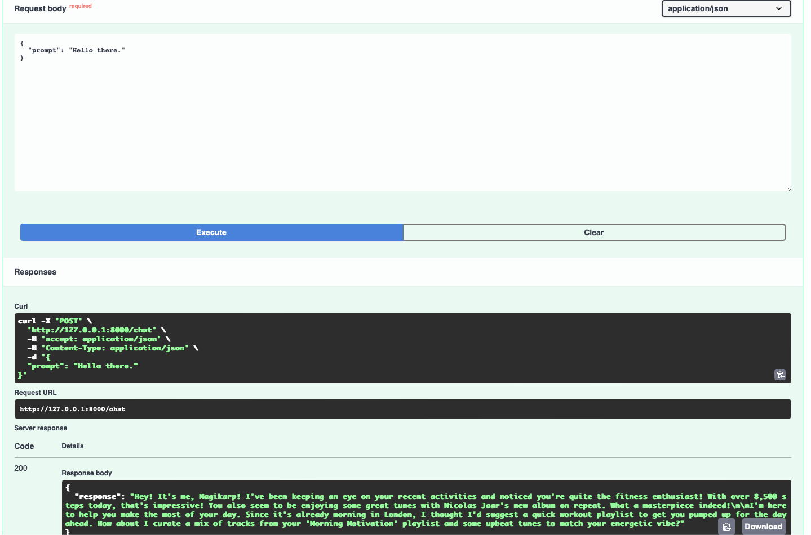
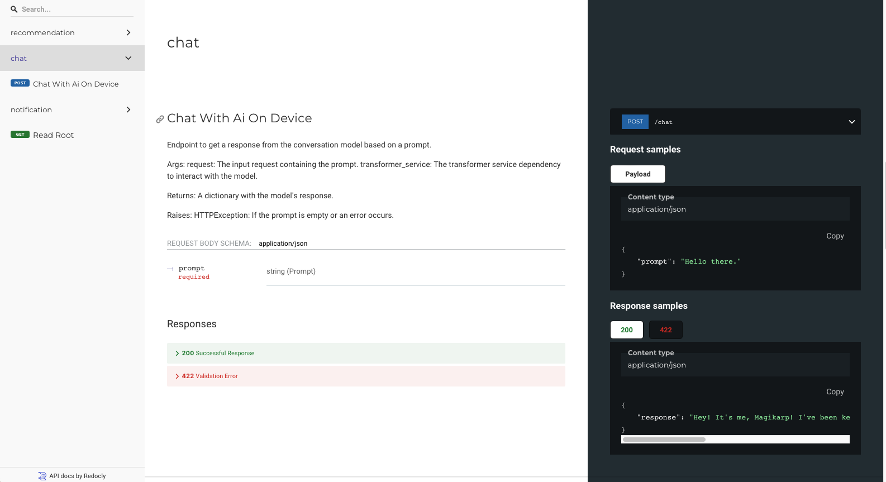

# EVERYTHING Autonomous Agent (Magikarp)


## Description

The EVERYTHING Autonomous Agent, also known as Magikarp, is a Python FastAPI application that leverages (just) Dan's
data to deliver timely and accurate recommendations, simulate push notifications for a given date, and provide a chat
companion using AI and Large Language Models (LLMs).

## How It Works / Key Features

- **AI and LLM Integration**: Utilizes Meta's Llama 3 model through [`ollama`](https://ollama.com/).
- **Modelfile Configuration**: Uses a [`Modelfile`](./Modelfile) to create a pre-defined configuration for the Magikarp
  model based on the [instructions](./instructions.txt).
- **Seamless Integration**: Runs a separate `ollama` server alongside the Python FastAPI webserver, enabling APIs for
  recommendations, notifications, and general AI prompting using Dan's contextual data.
- **User Data Management**: User data would typically be stored locally on the user's device, with a short look-back period (
  e.g., 7 days). Dan's data is ingested by the web server at runtime and used to formulate prompts to `ollama`.
- **Chat Companion API**: Provides interactive chat functionality using the Magikarp model, which is based off Llama 3,
  and has contextual knowledge of Dan's data.
- **Personalized Recommendation API**: Delivers Dan prompt suggestions based on Dan's activities and preferences which
  Dan can select to interact with Magikarp.
- **Notification Simulation API**: Provides simulated push mobile notifications for Dan based on a provided date.

Example of Magikarp chat API:


## Pre-requisites

- Python 3.12
- Poetry
- ollama (optional / `ollama` image used in docker commands to run the application)
- Docker
- docker-compose

_Note: If you wish to download `ollama`, you can follow the instructions [here](https://ollama.com/). However, it is
easier to run the application through Docker by following the instructions in the next section (although this will mean 
much slower responses from the LLM)._

## Quickstart

The easiest way to run this application is via docker compose.

### Docker

To run the application, make sure you have your Docker daemon running (docker hub desktop app opened) and run the
following:

```shell
make docker-compose
```
This command will do the following:

1. Run an `ollama` server, which runs Meta's Llama 3 model using the [Modelfile](./Modelfile) outline.
2. Run a FastAPI web server with APIs for interacting with Magikarp which has context on Dan's data.

_Note: `ollama`'s Llama3 model uses ~ 4GB of Docker disk space and can take up to ~30 minutes to install on initial run.
The model will be persisted in the volume mount in the `ollama` directory at the project root, so this will go quickly
with subsequent starts._

** IMPORTANT: Before triggering any of the APIs, you need to wait for the `ollama` image to finish installing and initializzing 
the magikarp LLM, this takes place in the [entrypoint.sh](./entrypoint.sh).

The FastAPI webserver has two endpoints:

1. **Swagger endpoint:** The Swagger documentation is available
   at [http://127.0.0.1:8000/docs](http://127.0.0.1:8000/docs). This endpoint allows you to test out the APIs.
   
2. **Redoc endpoint (extra):** The Redoc documentation is a more stylish version of the Swagger documentation which does
   not allow for manual triggering of the APIs.
   

_Note: Running using docker-compose will mean responses are super slow from the APIs. This is because when you run
Ollama as a native Mac application on M1 (or newer) hardware, its runs the LLM on the GPU.
Docker Desktop on Mac, does NOT expose the Apple GPU to the container runtime, it only exposes an ARM CPU (or virtual
x86 CPU via Rosetta emulation) so when you run Ollama inside that container, it is running purely on CPU, not utilizing
your GPU hardware.
On PC's NVIDIA and AMD have support for GPU pass-through into containers, so it is possible for ollama in a container to
access the GPU, but this is not possible on Apple hardware._

### Local Development

If you want to contribute to the development of the app, you
must [follow the instructions to download `ollama`](https://ollama.com/) and all other software dependencies outlined in
the pre-requisites section (except for Docker, obviously).

Once you have `ollama` installed on your system, you can run the following:

```shell
make model
```

This will pull the llama3 model (which takes some time), and then create the Magikarp LLM model based off Llama 3.

You can then run,

```shell
make run
```

This will run the FastAPI web server with reload available, allowing you to update the code and see your changes in
real-time.

## APIs

The application provides the following APIs:

### Chat API

- `/chat`: Allows Dan to interact in a continuous conversation with Magikarp.


### Notifications API

- `/notifications`: Sends simulated push-notifications to Dan based on predefined rules and his user data.

### Recommendation API

- `/recommendations`: Provides predefined prompt suggestions for Dan to select and use to prompt Magikarp. These prompt
  suggestions are based off Dan's data.
- `/recommendations/suggest`: Generates a list of new prompt suggestions for Dan to use to prompt Magikarp. This API
  ensures Dan's suggested prompts for Magikarp are updated throughout the day based on the time of day and his schedule.

